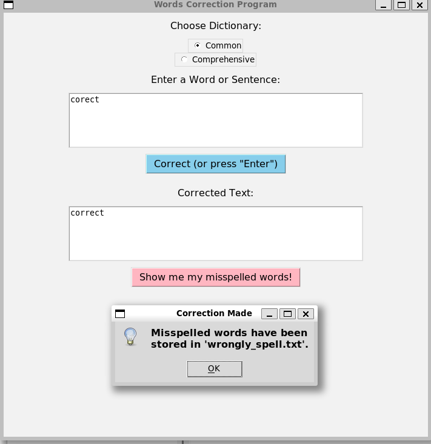
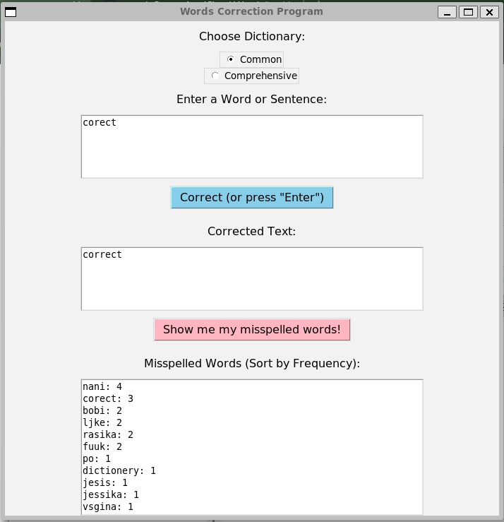

# Words Correction Program

This project is a **word correction application** built with Python, featuring:

- A **GUI interface** using `Tkinter`.
- **Efficient word lookup** using a **Trie** data structure.
- Integration with the **Levenshtein algorithm** for finding the closest matches for misspelled words.
- **Misspelled word tracking** with frequency counts.

---

## **Features**

### **1. Correct Words**
- Enter a word or sentence in the input box.
- Press the **"Correct (or press 'Enter')"** button or hit the `Enter` key to correct the text.
- The corrected text appears in the **"Corrected Text"** box.


### **2. Track Misspelled Words**
- Click **"Show me my misspelled words!"** to display words saved in `wrongly_spell.txt`, along with their frequencies.
- Misspelled words are dynamically tracked and updated.


### **3. Dynamic Misspelled Words Box**
- The **Misspelled Words Box** appears only when requested.
- It automatically hides when you start typing in the input box.

### **4. Dictionary Selection**
- Choose between two dictionaries:
  - **Common Dictionary**: A smaller, commonly used word set.
  - **Comprehensive Dictionary**: A larger, exhaustive word list.

---

## **Dependencies**

### **Required Libraries**
- Python 3.x
- `Tkinter` (for GUI)
- `Levenshtein` (for calculating string similarity)

### **Install Dependencies**
Run the following command to install the `Levenshtein` library:
```bash
pip install python-Levenshtein
